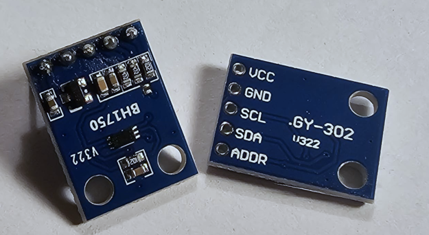

# Toit BH1750 Module Driver
Toit driver for the Rohm Semi BH1750 Ambient Light Sensor.  [Manufacturer Datasheet](https://www.mouser.com/datasheet/2/348/bh1750fvi-e-186247.pdf).  This driver is slightly different from many I2C modules, it is not read/written using registers, so extra smarts are required of the driver.

## Modes
The device operates in two modes:
### Continuous
The sensor keeps measuring lux continuously and updating its data register.
  - A reading can be made at any time.
  - Power consumption is higher since it never stops measuring.
  - Useful for real-time, frequent updates (e.g. dimming a display continuously as light changes).
Continuous Modes:
  - Continuous High Resolution (~1 lux resolution, ~120 ms measurement time)
  - Continuous High Resolution Mode 2 (~0.5 lux resolution, ~120 ms, more precise)
  - Continuous Low Resolution (~4 lux resolution, ~16 ms, faster but coarser)

### One-Time (or Triggered)
The sensor makes a single measurement, puts the result into the data register, and then goes into power-down automatically.
- Consumes less power since it’s off when not measuring.
- The mode command must be sent again each time a new reading is required. (Handled by this driver)
- Good for battery-powered devices where you only need periodic light checks.
One-Time Modes (same as for Continuous):
  - Continuous High Resolution (~1 lux resolution, ~120 ms measurement time)
  - Continuous High Resolution Mode 2 (~0.5 lux resolution, ~120 ms, more precise)
  - Continuous Low Resolution (~4 lux resolution, ~16 ms, faster but coarser)

### Power Usage by Mode

| Mode                   | Typical Current                       | Notes                                                                                          |
| ---------------------- | ------------------------------------- | ---------------------------------------------------------------------------------------------- |
| Power Down             | 0.00000001 A (~0.01 µA)               | Essentially off                                                                                |
| Continuous Measurement | 0.012 A (~0.12 mA)                    | Active, sensor always measuring                                                                |
| One-Time Measurement   | 0.012 A (~0.12 mA during measurement) | ~0.01 µA (after auto power-down) Spikes during the ~16–120 ms measurement, then almost nothing |
| Reset                  | 0.00000001 A (~0.01 µA)               | Same as power-down                                                                             |

## Other Features
### MTREG
MTREG is the Measurement/Time (integration-time/sensitivity) register.  Its a value that can be set between 31.0 (`MTREG-MIN`) and 254.0 (`MTREG-MAX`).  (Default is 69 `MTREG-DEFAULT`)
#### Guidance:
- Bigger MTREG  = longer exposure  = higher sensitivity.  Better in the dark, but lower max lux before the 16-bit register saturates.  Use when indoors or in dim environments: raise MTREG (e.g., 138–200) for smoother, less noisy readings.
- Smaller MTREG = shorter exposure = lower sensitivity.  Better in bright light, and higher max lux, but less sensitive. Use when Outdoors/bright/near windows: lower the MTREG (e.g., 40–69) to avoid clipping and speed up reads.
Use the functions `set-mtreg` to set this.  The driver caches the value to use in lux calculations.  This can be retrieved by `get-mtreg`.

### Correction Factor
The BH1750 is factory-calibrated for a typical light spectrum (roughly daylight, ~2856 K).  In practice the response of the sensor doesn’t perfectly match the human eye or all given specific light sources.  Therefore the driver contains a multiplier applied to the lux value from the device, called 'correction factor'.  This value can account for real-world conditions vs. default calibration.  By default this value is 1.2 (`CORRECTION-FACTOR-DEFAULT`), and valid range is 0.96 to 1.44. (`CORRECTION-FACTOR-MIN` to `CORRECTION-FACTOR-MAX`).
#### Example:
Under fluorescent or LED light, the reading can drift (often 10–20% off).  If the use case demands accuracy, obtaining a light reading from a known good device, this multipler can be used to correct the raw output.
#### Values:
- 1.2 - makes the reading closer to the photopic curve of the human eye (driver default).
- 1.0 - leaves uncorrected.
- For relative changes/measurements, this value can be safely ignored.

## Usage
See Examples folder

## Credits
Credits to Justin Decker, the writer of the [original driver](https://github.com/justind000/BH1750_Toit_driver) on which this work is built.
